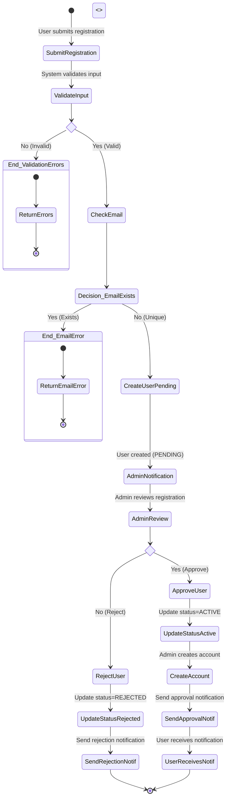
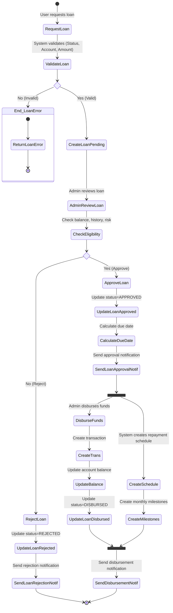
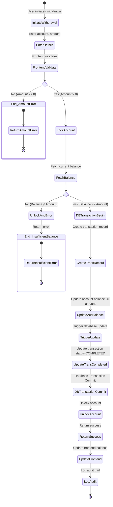

# Activity Diagrams - Microfinance Transaction Manager

## 1. User Registration Approval Process

```mermaid
stateDiagram-v2
    [*] --> SubmitRegistration: User submits registration
    SubmitRegistration --> ValidateInput: System validates input
    state Decision_Valid <<choice>>
    ValidateInput --> Decision_Valid
    Decision_Valid --> End_ValidationErrors: No (Invalid)
    Decision_Valid --> CheckEmail: Yes (Valid)
    
    CheckEmail --> Decision_EmailExists <<choice>>
    Decision_EmailExists --> End_EmailError: Yes (Exists)
    Decision_EmailExists --> CreateUserPending: No (Unique)
    
    CreateUserPending --> AdminNotification: User created (PENDING)
    AdminNotification --> AdminReview: Admin reviews registration
    
    state Decision_Approve <<choice>>
    AdminReview --> Decision_Approve
    Decision_Approve --> RejectUser: No (Reject)
    Decision_Approve --> ApproveUser: Yes (Approve)
    
    RejectUser --> UpdateStatusRejected: Update status=REJECTED
    UpdateStatusRejected --> SendRejectionNotif: Send rejection notification
    SendRejectionNotif --> [*]
    
    ApproveUser --> UpdateStatusActive: Update status=ACTIVE
    UpdateStatusActive --> CreateAccount: Admin creates account
    CreateAccount --> SendApprovalNotif: Send approval notification
    SendApprovalNotif --> UserReceivesNotif: User receives notification
    UserReceivesNotif --> [*]

    state End_ValidationErrors {
        [*] --> ReturnErrors
        ReturnErrors --> [*]
    }
    state End_EmailError {
        [*] --> ReturnEmailError
        ReturnEmailError --> [*]
    }
```

## 2. Loan Request & Approval Process

```mermaid
stateDiagram-v2
    [*] --> RequestLoan: User requests loan
    RequestLoan --> ValidateLoan: System validates (Status, Account, Amount)
    
    state Decision_LoanValid <<choice>>
    ValidateLoan --> Decision_LoanValid
    Decision_LoanValid --> End_LoanError: No (Invalid)
    Decision_LoanValid --> CreateLoanPending: Yes (Valid)
    
    CreateLoanPending --> AdminReviewLoan: Admin reviews loan
    AdminReviewLoan --> CheckEligibility: Check balance, history, risk
    
    state Decision_LoanApprove <<choice>>
    CheckEligibility --> Decision_LoanApprove
    Decision_LoanApprove --> RejectLoan: No (Reject)
    Decision_LoanApprove --> ApproveLoan: Yes (Approve)
    
    RejectLoan --> UpdateLoanRejected: Update status=REJECTED
    UpdateLoanRejected --> SendLoanRejectionNotif: Send rejection notification
    SendLoanRejectionNotif --> [*]
    
    ApproveLoan --> UpdateLoanApproved: Update status=APPROVED
    UpdateLoanApproved --> CalculateDueDate: Calculate due date
    CalculateDueDate --> SendLoanApprovalNotif: Send approval notification
    
    state Parallel_Processing <<fork>>
    SendLoanApprovalNotif --> Parallel_Processing
    
    Parallel_Processing --> DisburseFunds: Admin disburses funds
    DisburseFunds --> CreateTrans: Create transaction
    CreateTrans --> UpdateBalance: Update account balance
    UpdateBalance --> UpdateLoanDisbursed: Update status=DISBURSED
    
    Parallel_Processing --> CreateSchedule: System creates repayment schedule
    CreateSchedule --> CreateMilestones: Create monthly milestones
    
    state Join_Processing <<join>>
    UpdateLoanDisbursed --> Join_Processing
    CreateMilestones --> Join_Processing
    
    Join_Processing --> SendDisbursementNotif: Send disbursement notification
    SendDisbursementNotif --> [*]

    state End_LoanError {
        [*] --> ReturnLoanError
        ReturnLoanError --> [*]
    }
```

## 3. Withdrawal with Overdraft Prevention

```mermaid
stateDiagram-v2
    [*] --> InitiateWithdrawal: User initiates withdrawal
    InitiateWithdrawal --> EnterDetails: Enter account, amount
    EnterDetails --> FrontendValidate: Frontend validates
    
    state Decision_AmountValid <<choice>>
    FrontendValidate --> Decision_AmountValid
    Decision_AmountValid --> End_AmountError: No (Amount <= 0)
    Decision_AmountValid --> LockAccount: Yes (Amount > 0)
    
    LockAccount --> FetchBalance: Fetch current balance
    
    state Decision_BalanceCheck <<choice>>
    FetchBalance --> Decision_BalanceCheck
    Decision_BalanceCheck --> UnlockAndError: No (Balance < Amount)
    Decision_BalanceCheck --> DBTransactionBegin: Yes (Balance >= Amount)
    
    UnlockAndError --> End_InsufficientBalance: Return error
    
    DBTransactionBegin --> CreateTransRecord: Create transaction record
    CreateTransRecord --> UpdateAccBalance: Update account balance -= amount
    UpdateAccBalance --> TriggerUpdate: Trigger database update
    TriggerUpdate --> UpdateTransCompleted: Update transaction status=COMPLETED
    UpdateTransCompleted --> DBTransactionCommit: Database Transaction Commit
    
    DBTransactionCommit --> UnlockAccount: Unlock account
    UnlockAccount --> ReturnSuccess: Return success
    ReturnSuccess --> UpdateFrontend: Update frontend balance
    UpdateFrontend --> LogAudit: Log audit trail
    LogAudit --> [*]

    state End_AmountError {
        [*] --> ReturnAmountError
        ReturnAmountError --> [*]
    }
    state End_InsufficientBalance {
        [*] --> ReturnInsufficientError
        ReturnInsufficientError --> [*]
    }
```
