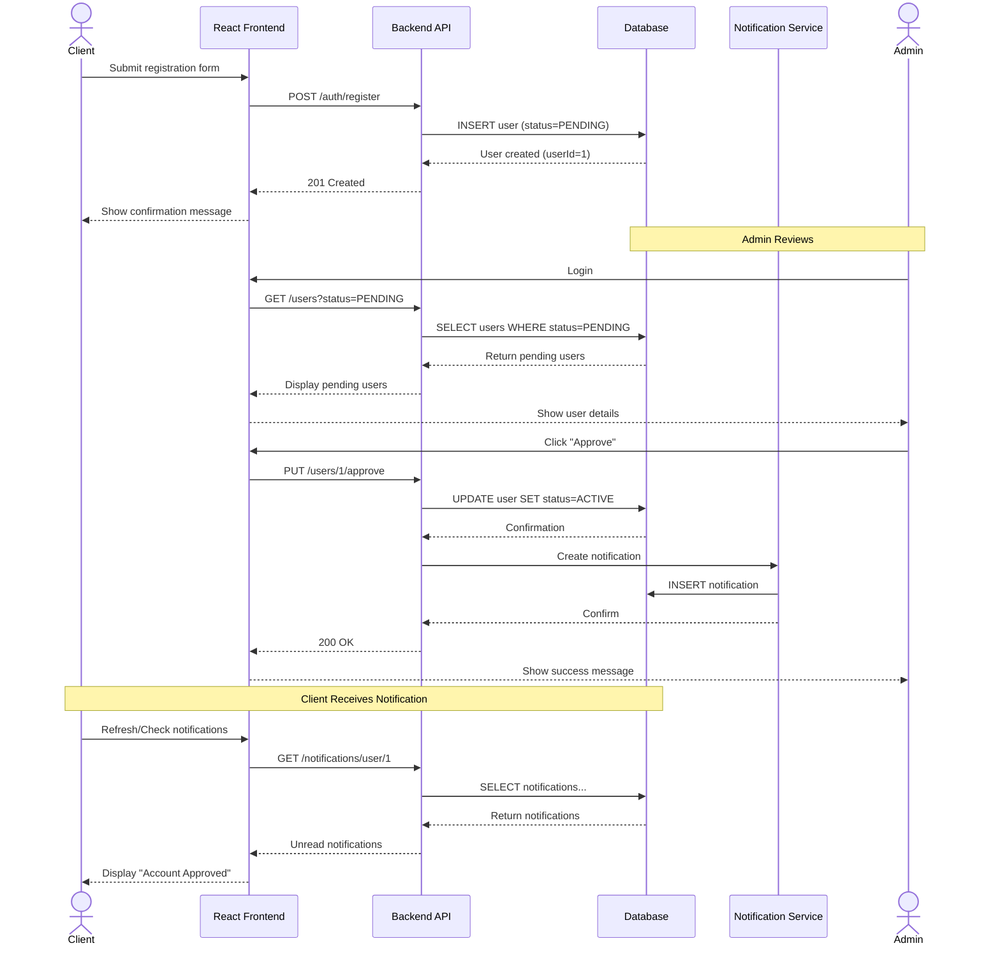
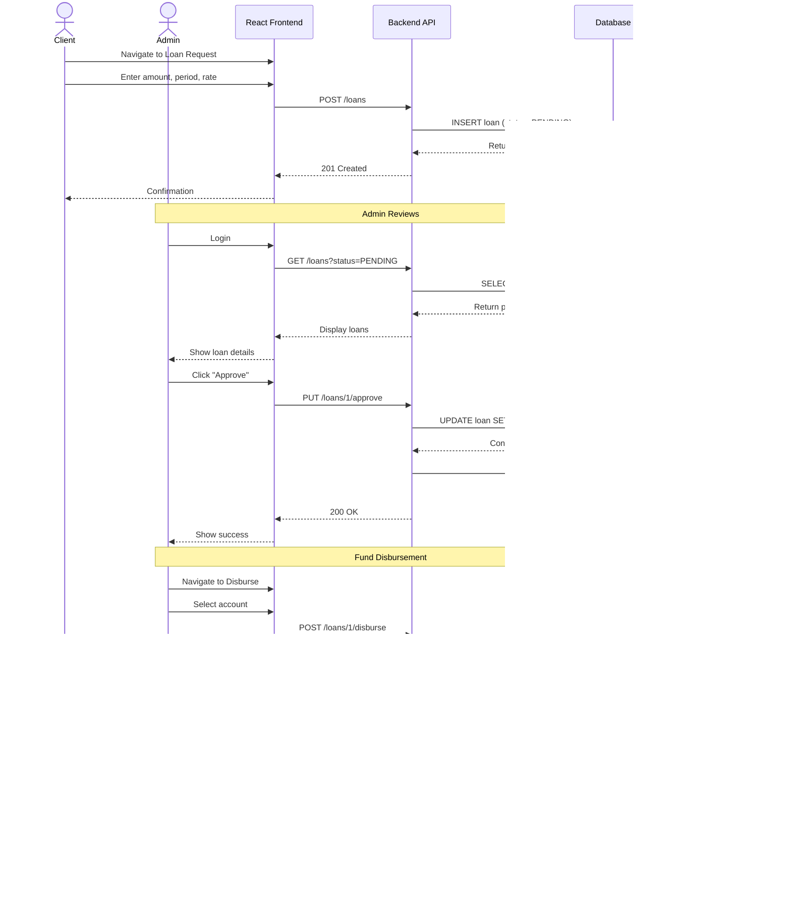
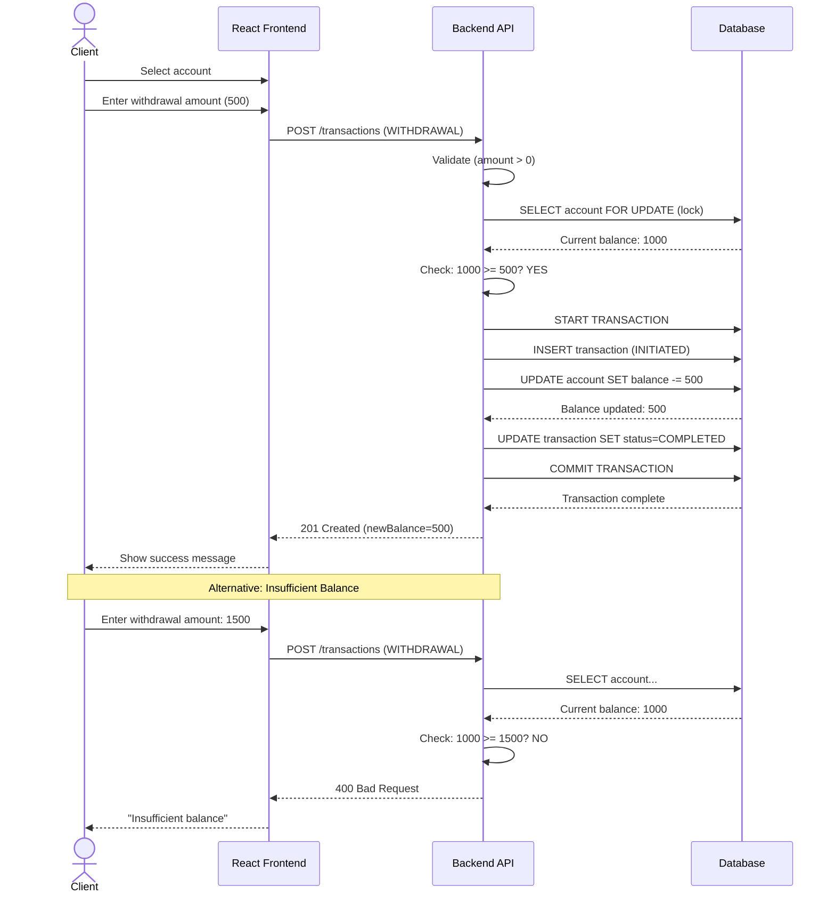

# Sequence Diagrams - Microfinance Transaction Manager

## 1. User Registration & Approval Sequence

```mermaid
sequenceDiagram
    actor Client
    participant Frontend as React Frontend
    participant Backend as Backend API
    participant DB as Database
    participant Notif as Notification Service
    actor Admin

    Client->>Frontend: Submit registration form
    Frontend->>Backend: POST /auth/register
    Backend->>DB: INSERT user (status=PENDING)
    DB-->>Backend: User created (userId=1)
    Backend-->>Frontend: 201 Created
    Frontend-->>Client: Show confirmation message

    Note over Admin, DB: Admin Reviews
    Admin->>Frontend: Login
    Frontend->>Backend: GET /users?status=PENDING
    Backend->>DB: SELECT users WHERE status=PENDING
    DB-->>Backend: Return pending users
    Backend-->>Frontend: Display pending users
    Frontend-->>Admin: Show user details
    Admin->>Frontend: Click "Approve"
    Frontend->>Backend: PUT /users/1/approve
    Backend->>DB: UPDATE user SET status=ACTIVE
    DB-->>Backend: Confirmation
    Backend->>Notif: Create notification
    Notif->>DB: INSERT notification
    Notif-->>Backend: Confirm
    Backend-->>Frontend: 200 OK
    Frontend-->>Admin: Show success message

    Note over Client, DB: Client Receives Notification
    Client->>Frontend: Refresh/Check notifications
    Frontend->>Backend: GET /notifications/user/1
    Backend->>DB: SELECT notifications...
    DB-->>Backend: Return notifications
    Backend-->>Frontend: Unread notifications
    Frontend-->>Client: Display "Account Approved"
```

## 2. Loan Request & Approval Sequence

```mermaid
sequenceDiagram
    actor Client
    actor Admin
    participant Frontend as React Frontend
    participant Backend as Backend API
    participant DB as Database
    participant Notif as Notification Service

    Client->>Frontend: Navigate to Loan Request
    Client->>Frontend: Enter amount, period, rate
    Frontend->>Backend: POST /loans
    Backend->>DB: INSERT loan (status=PENDING)
    DB-->>Backend: Return loanId
    Backend-->>Frontend: 201 Created
    Frontend-->>Client: Confirmation

    Note over Admin, DB: Admin Reviews
    Admin->>Frontend: Login
    Frontend->>Backend: GET /loans?status=PENDING
    Backend->>DB: SELECT loans...
    DB-->>Backend: Return pending loans
    Backend-->>Frontend: Display loans
    Frontend-->>Admin: Show loan details
    Admin->>Frontend: Click "Approve"
    Frontend->>Backend: PUT /loans/1/approve
    Backend->>DB: UPDATE loan SET status=APPROVED
    DB-->>Backend: Confirmation
    Backend->>Notif: Create notification
    Notif->>DB: INSERT notification
    Backend-->>Frontend: 200 OK
    Frontend-->>Admin: Show success

    Note over Admin, DB: Fund Disbursement
    Admin->>Frontend: Navigate to Disburse
    Admin->>Frontend: Select account
    Frontend->>Backend: POST /loans/1/disburse
    Backend->>DB: START TRANSACTION
    Backend->>DB: UPDATE loan SET status=DISBURSED
    Backend->>DB: INSERT transaction (LOAN_DISBURSEMENT)
    Backend->>DB: UPDATE account SET balance += 5000
    Backend->>DB: INSERT notification
    Backend->>DB: COMMIT TRANSACTION
    DB-->>Backend: Transaction complete
    Backend-->>Frontend: 200 OK
    Frontend-->>Admin: Confirmation
```

## 3. Deposit/Withdrawal Transaction Sequence

```mermaid
sequenceDiagram
    actor Client
    participant Frontend as React Frontend
    participant Backend as Backend API
    participant DB as Database

    Client->>Frontend: Select account
    Client->>Frontend: Enter withdrawal amount (500)
    Frontend->>Backend: POST /transactions (WITHDRAWAL)
    Backend->>Backend: Validate (amount > 0)
    Backend->>DB: SELECT account FOR UPDATE (lock)
    DB-->>Backend: Current balance: 1000
    Backend->>Backend: Check: 1000 >= 500? YES
    Backend->>DB: START TRANSACTION
    Backend->>DB: INSERT transaction (INITIATED)
    Backend->>DB: UPDATE account SET balance -= 500
    DB-->>Backend: Balance updated: 500
    Backend->>DB: UPDATE transaction SET status=COMPLETED
    Backend->>DB: COMMIT TRANSACTION
    DB-->>Backend: Transaction complete
    Backend-->>Frontend: 201 Created (newBalance=500)
    Frontend-->>Client: Show success message

    Note over Client, Backend: Alternative: Insufficient Balance
    Client->>Frontend: Enter withdrawal amount: 1500
    Frontend->>Backend: POST /transactions (WITHDRAWAL)
    Backend->>DB: SELECT account...
    DB-->>Backend: Current balance: 1000
    Backend->>Backend: Check: 1000 >= 1500? NO
    Backend-->>Frontend: 400 Bad Request
    Frontend-->>Client: "Insufficient balance"
```
