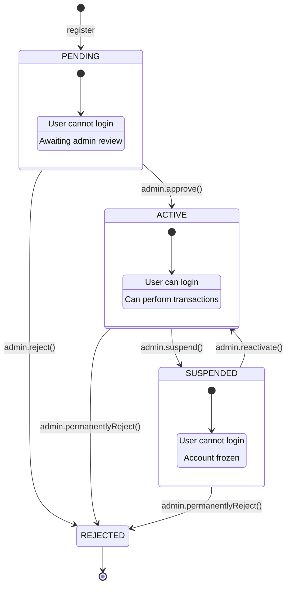
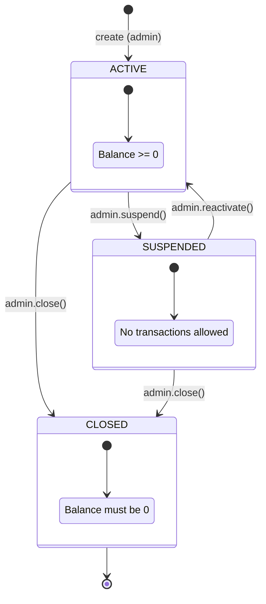
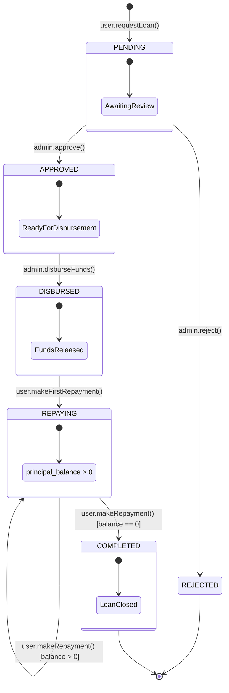

# State Diagrams - Microfinance Transaction Manager

## 1. User State Diagram

```mermaid
stateDiagram-v2
    [*] --> PENDING : register
    
    state PENDING {
        [*] --> WaitingForReview
        WaitingForReview : User cannot login
        WaitingForReview : Awaiting admin review
    }
    
    PENDING --> ACTIVE : admin.approve()
    PENDING --> REJECTED : admin.reject()
    
    state ACTIVE {
        [*] --> Ready
        Ready : User can login
        Ready : Can perform transactions
    }
    
    ACTIVE --> SUSPENDED : admin.suspend()
    ACTIVE --> REJECTED : admin.permanentlyReject()
    
    state SUSPENDED {
        [*] --> Frozen
        Frozen : User cannot login
        Frozen : Account frozen
    }
    
    SUSPENDED --> ACTIVE : admin.reactivate()
    SUSPENDED --> REJECTED : admin.permanentlyReject()
    
    REJECTED --> [*]
```

## 2. Account State Diagram

```mermaid
stateDiagram-v2
    [*] --> ACTIVE : create (admin)
    
    state ACTIVE {
        [*] --> ReadyForTransactions
        ReadyForTransactions : Balance >= 0
    }
    
    ACTIVE --> SUSPENDED : admin.suspend()
    ACTIVE --> CLOSED : admin.close()
    
    state SUSPENDED {
        [*] --> Frozen
        Frozen : No transactions allowed
    }
    
    SUSPENDED --> ACTIVE : admin.reactivate()
    SUSPENDED --> CLOSED : admin.close()
    
    state CLOSED {
        [*] --> Finalized
        Finalized : Balance must be 0
    }
    
    CLOSED --> [*]
```

## 3. Loan State Diagram

```mermaid
stateDiagram-v2
    [*] --> PENDING : user.requestLoan()
    
    state PENDING {
        [*] --> AwaitingReview
    }
    
    PENDING --> APPROVED : admin.approve()
    PENDING --> REJECTED : admin.reject()
    
    state APPROVED {
        [*] --> ReadyForDisbursement
    }
    
    APPROVED --> DISBURSED : admin.disburseFunds()
    
    state DISBURSED {
        [*] --> FundsReleased
    }
    
    DISBURSED --> REPAYING : user.makeFirstRepayment()
    
    state REPAYING {
        [*] --> InstallmentsPending
        InstallmentsPending : principal_balance > 0
    }
    
    REPAYING --> REPAYING : user.makeRepayment() [balance > 0]
    REPAYING --> COMPLETED : user.makeRepayment() [balance == 0]
    
    state COMPLETED {
        [*] --> LoanClosed
    }
    
    REJECTED --> [*]
    COMPLETED --> [*]
```
