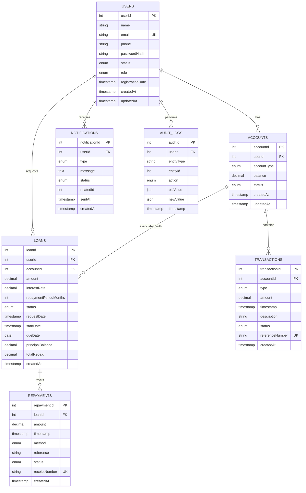

```mermaid
erDiagram
    USERS ||--o{ ACCOUNTS : has
    USERS ||--o{ LOANS : requests
    USERS ||--o{ NOTIFICATIONS : receives
    USERS ||--o{ AUDIT_LOGS : performs
    ACCOUNTS ||--o{ TRANSACTIONS : contains
    ACCOUNTS ||--o{ LOANS : associated_with
    LOANS ||--o{ REPAYMENTS : tracks

    USERS {
        int userId PK
        string name
        string email UK
        string phone
        string passwordHash
        enum status
        enum role
        timestamp registrationDate
        timestamp createdAt
        timestamp updatedAt
    }

    ACCOUNTS {
        int accountId PK
        int userId FK
        enum accountType
        decimal balance
        enum status
        timestamp createdAt
        timestamp updatedAt
    }

    TRANSACTIONS {
        int transactionId PK
        int accountId FK
        enum type
        decimal amount
        timestamp timestamp
        string description
        enum status
        string referenceNumber UK
        timestamp createdAt
    }

    LOANS {
        int loanId PK
        int userId FK
        int accountId FK
        decimal amount
        decimal interestRate
        int repaymentPeriodMonths
        enum status
        timestamp requestDate
        timestamp startDate
        date dueDate
        decimal principalBalance
        decimal totalRepaid
        timestamp createdAt
    }

    REPAYMENTS {
        int repaymentId PK
        int loanId FK
        decimal amount
        timestamp timestamp
        enum method
        string reference
        enum status
        string receiptNumber UK
        timestamp createdAt
    }

    NOTIFICATIONS {
        int notificationId PK
        int userId FK
        enum type
        text message
        enum status
        int relatedId
        timestamp sentAt
        timestamp createdAt
    }

    AUDIT_LOGS {
        int auditId PK
        int userId FK
        string entityType
        int entityId
        enum action
        json oldValue
        json newValue
        timestamp timestamp
    }
```
